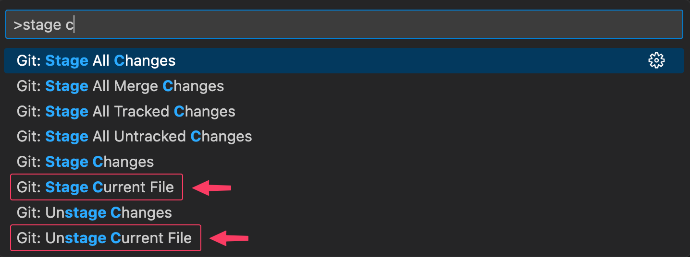

# git-stage 🗄️

A VSCode extension for staging/unstaging files without changes from outside of the source control
window.

</img>

**Table of Contents**

- [Features](#features)
  - [Wait, isn't this already included in VSCode's default Git integration?](#wait-isnt-this-already-included-in-vscodes-default-git-integration)
- [Commands](#commands)
  - [Command palette](#command-palette)
  - [Explorer view - context menu](#explorer-view---context-menu)
- [Extension settings](#extension-settings)

## Features

- Stage/unstage files with or without changes, directly from the explorer or currently opened file.
- Integrates seamlessly with the default Git integration.

#### Wait, isn't this already included in VSCode's default Git integration?

Sort of, but not really. The default Git integration only provides commands to stage/unstage files
with changes, unless you do it from the Source Control window.

This can be really annoying in situations where you have a _lot_ of untracked files (e.g. when
working with bare git repos for dotfiles), in which case it is a lot more convenient to stage files
directly from the explorer view.

The Git integration does however expose all the necessary APIs to achieve this under the hood, which
is what this extension is using.

## Commands

### Command palette

- `Git: Stage Current File`  
  Stages the file currently opened in the editor.

- `Git: Unstage Current File`  
  Unstages the file currently opened in the editor.

### Explorer view - context menu

- `Git: Stage Selected Files`  
  Stages the file(s) selected in the explorer.

- `Git: Unstage Selected Files`  
  Unstages the file(s) selected in the explorer.

## Extension settings

None, so far.
